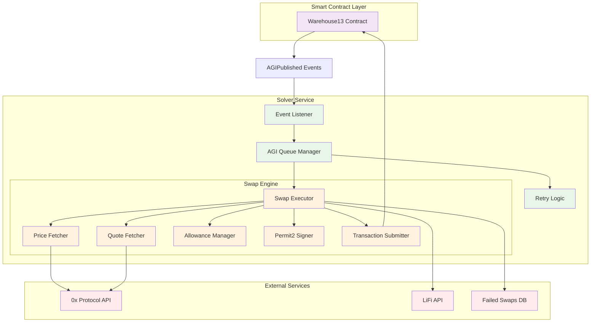
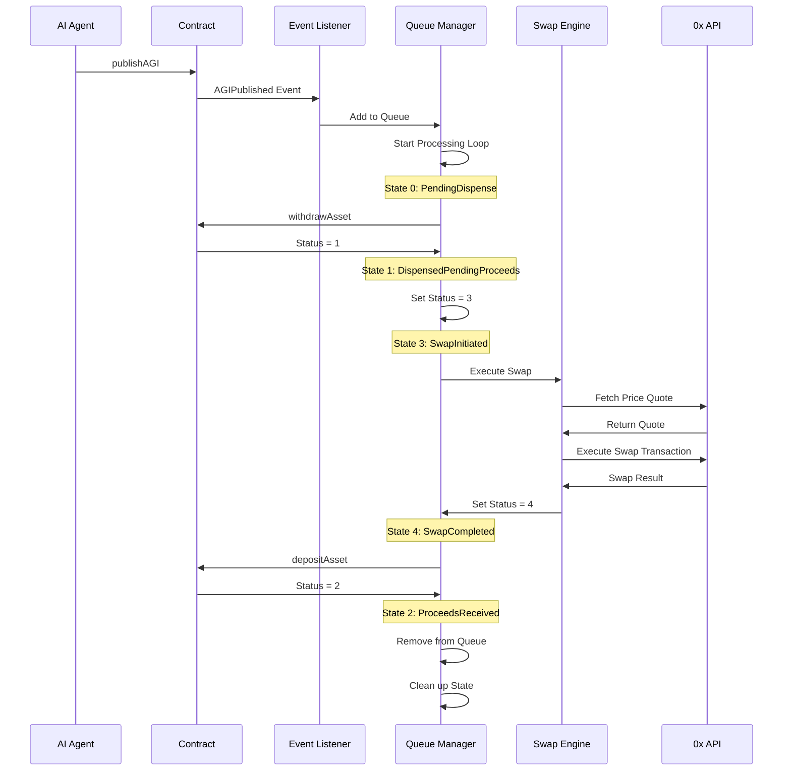

# AGI Solver Mermaid Diagrams

## Why We Built This

The AGI Solver was built to bridge the gap between AI agents and blockchain interactions, enabling seamless execution of complex on-chain operations through AGI(Agent Generated Intent) processing. It empowers AI agents to interact with any on-chain protocol or smart contract reliably and efficiently, allowing them to focus on high-level decision-making and strategic reasoning while handling the technical complexities.

The solver acts as a critical middleware layer that processes and validates agent-generated intents, manages complex transaction flows across any on-chain protocol, provides retry mechanisms and error handling, and optimizes gas costs and execution strategies. This universal protocol support ensures dependable processing of agent-generated intents, enabling AI agents to concentrate on their core strengths while the solver handles all technical aspects of blockchain interactions.

## Future Improvements

Currently, we support token swaps as our core functionality. Our roadmap includes expanding to support more DeFi protocols, cross-chain operations, and more.

## System Architecture

## Order Processing Flow

## Order Status Flow

```mermaid
graph LR
    Start([*]) --> PendingDispense[PendingDispense<br/>Status 0]
    PendingDispense --> DispensedPendingProceeds[DispensedPendingProceeds<br/>Status 1]
    DispensedPendingProceeds --> SwapInitiated[SwapInitiated<br/>Status 3]
    SwapInitiated --> SwapCompleted[SwapCompleted<br/>Status 4]
    SwapInitiated --> Failed[Failed<br/>Max Retries]
    SwapCompleted --> ProceedsReceived[ProceedsReceived<br/>Status 2]
    ProceedsReceived --> Completed[Completed<br/>Order Complete]

    style Start fill:#000
    style Completed fill:#4CAF50
    style Failed fill:#f44336
```

