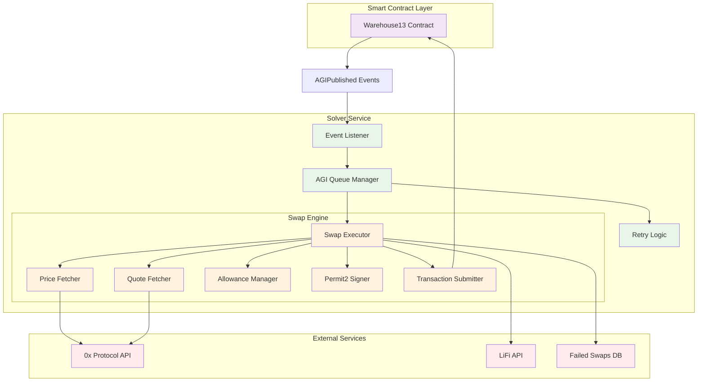
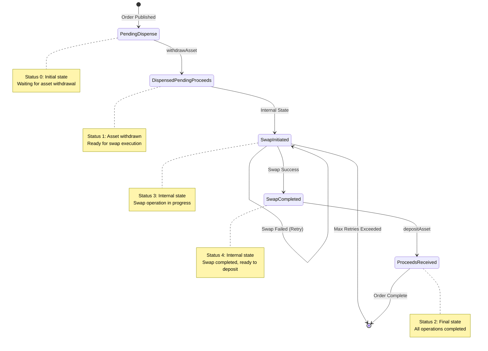

# AGI Solver Mermaid Diagrams

## System Architecture

```mermaid
graph TB
    %% Smart Contract Layer
    subgraph "Smart Contract Layer"
        Warehouse13[Warehouse13 Contract]
    end

    %% Events
    Events[AGIPublished Events]

    %% Solver Service Layer
    subgraph "Solver Service"
        EventListener[Event Listener]
        QueueManager[AGI Queue Manager]
        
        subgraph "Swap Engine"
            PriceFetcher[Price Fetcher]
            QuoteFetcher[Quote Fetcher]
            AllowanceManager[Allowance Manager]
            Permit2Signer[Permit2 Signer]
            TransactionSubmitter[Transaction Submitter]
            SwapExecutor[Swap Executor]
        end
        
        RetryLogic[Retry Logic]
    end

    %% External Services
    subgraph "External Services"
        ZeroExAPI[0x Protocol API]
        LifiAPI[LiFi API]
        FailedDB[Failed Swaps DB]
    end

    %% Order Flow
    Warehouse13 --> Events
    
    %% Event Processing
    Events --> EventListener
    EventListener --> QueueManager
    
    %% Queue Processing
    QueueManager --> SwapExecutor
    QueueManager --> RetryLogic
    
    %% Swap Engine Internal Flow
    SwapExecutor --> PriceFetcher
    SwapExecutor --> QuoteFetcher
    SwapExecutor --> AllowanceManager
    SwapExecutor --> Permit2Signer
    SwapExecutor --> TransactionSubmitter
    
    %% External API Calls
    PriceFetcher --> ZeroExAPI
    QuoteFetcher --> ZeroExAPI
    SwapExecutor --> LifiAPI
    SwapExecutor --> FailedDB
    
    %% Order Completion
    TransactionSubmitter --> Warehouse13
    
    %% Styling
    classDef contractLayer fill:#f3e5f5
    classDef serviceLayer fill:#e8f5e8
    classDef swapEngineLayer fill:#fff3e0
    classDef externalLayer fill:#ffebee
    
    class Warehouse13 contractLayer
    class EventListener,QueueManager,RetryLogic serviceLayer
    class PriceFetcher,QuoteFetcher,AllowanceManager,Permit2Signer,TransactionSubmitter,SwapExecutor swapEngineLayer
    class ZeroExAPI,LifiAPI,FailedDB externalLayer
```

## Order Processing Flow

```mermaid
sequenceDiagram
    participant U as User
    participant C as Contract
    participant E as Event Listener
    participant Q as Queue Manager
    participant S as Swap Engine
    participant Z as 0x API

    %% Order Publishing
    U->>C: publishAGI
    C->>E: AGIPublished Event
    
    %% Queue Management
    E->>Q: Add to Queue
    Q->>Q: Start Processing Loop
    
    %% Order Processing States
    Note over Q: State 0: PendingDispense
    Q->>C: withdrawAsset
    C->>Q: Status = 1
    
    Note over Q: State 1: DispensedPendingProceeds
    Q->>Q: Set Status = 3
    
    Note over Q: State 3: SwapInitiated
    Q->>S: Execute Swap
    S->>Z: Fetch Price Quote
    Z->>S: Return Quote
    S->>Z: Execute Swap Transaction
    Z->>S: Swap Result
    S->>Q: Set Status = 4
    
    Note over Q: State 4: SwapCompleted
    Q->>C: depositAsset
    C->>Q: Status = 2
    
    Note over Q: State 2: ProceedsReceived
    Q->>Q: Remove from Queue
    Q->>Q: Clean up State
```

## Order Status Flow

```mermaid
stateDiagram-v2
    [*] --> PendingDispense: Order Published
    
    PendingDispense --> DispensedPendingProceeds: withdrawAsset
    DispensedPendingProceeds --> SwapInitiated: Internal State
    
    SwapInitiated --> SwapCompleted: Swap Success
    SwapInitiated --> SwapInitiated: Swap Failed (Retry)
    SwapInitiated --> [*]: Max Retries Exceeded
    
    SwapCompleted --> ProceedsReceived: depositAsset
    ProceedsReceived --> [*]: Order Complete
    
    note right of PendingDispense
        Status 0: Initial state
        Waiting for asset withdrawal
    end note
    
    note right of DispensedPendingProceeds
        Status 1: Asset withdrawn
        Ready for swap execution
    end note
    
    note right of SwapInitiated
        Status 3: Internal state
        Swap operation in progress
    end note
    
    note right of SwapCompleted
        Status 4: Internal state
        Swap completed, ready to deposit
    end note
    
    note right of ProceedsReceived
        Status 2: Final state
        All operations completed
    end note
```